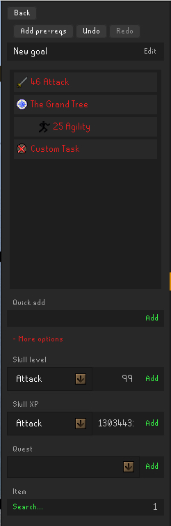

# 🏆 Goal Tracker

> A complete reimagining of the Goal Tracker plugin — rebuilt with a more modern UI, powerful new features, and improved stability to help you plan, track, and achieve your Old School RuneScape goals with ease.

---

<h2 style="margin:0;display:inline;">✨ New Features</h2>

- Shift+Click removal of tasks for faster task management  
- New ActionBar and ActionBarButton UI components  
- Hover states for better visual feedback  
- New context menu organization for streamlined interaction  
- Search toggle improvements for easier task searching  
- New task right‑click menu with grouped **Move** submenu and cascading complete/incomplete toggle that applies to children  
- Redesigned goal cards with lighter fills, full shadows, and hover/press effects on the card face
- Export and Import functionality to save and load goals via JSON files
- Presets automatically expand quest prerequisites  
- Goal titles and ManualTask descriptions support click-to-edit with inline text fields  
- Long goal and task titles are ellipsized with … and show full text on hover  

### ♻️ Redesigned Features

- Redesigned quest prerequisites button for quick access  
- Redesigned completion cascading to automatically complete related tasks  
- Redesigned dropdown quest selector for faster quest task addition  
- Redesigned right-click menus for prerequisites and child completion options  
- Redesigned manual toggling for preset tasks  
- Redesigned chatbox notification colors with customization options  
- Redesigned quest status detection with improved auto-refresh  
- Redesigned completion chat messages delivered as proper Game messages  

<h2 style="margin:0;display:inline;">🔧 Improvements</h2>

- Refreshed UI with updated design elements and improved readability  
- Consistent ActionBar UI throughout the plugin  
- Unified goal view header for a cohesive look  
- Improved context menus and hover detection accuracy  
- Copy and paste support in the goal name input field  
- Refined ActionBar spacing to fit Export and Import buttons without overlap  
- Progress text (e.g., “1/10”) on goal cards now has reserved width and never clips  
- + Add goal and Add from Preset buttons restyled and stacked vertically  
- Task rows updated to match goal cards with icons and ellipsized titles  
- Debounced quest detection and scheduled UI refresh to prevent lag  
- Goal/task panels auto-refresh reliably after quest or item detection  
- Extended item task detection to include equipment, seed vault, and group storage  

<h2 style="margin:0;display:inline;">🐛 Fixes</h2>

- Undo/Redo functionality cleanup for smoother editing  
- ActionBarButton painting fixes to prevent visual glitches  
- Improved refresh behavior in Home and List panels  
- Enhanced mouse selection accuracy  
- Keyboard shortcut fixes and enhancements  
- Automatic removal of empty goals to keep lists tidy  
- Visual refresh issue resolved on login  
- Fixed child task refresh issues  
- Fixed blank panel issue when switching views  
- Fixed completion chat messages to appear properly with configured colors  
- Export/Import buttons now work correctly  
- Item icons preload correctly on startup, login, and after import  
- Home panel refreshes correctly after completing a task  
- Layout adjustments to fix overlapping Export button  
- Fixed Shield of Arrav preset indentation for partner-finding step  
- Sidebar refreshes automatically after quest or item detection  

<h2 style="margin:0;display:inline;">🖼️ Screenshots</h2>

### Home panel with goal cards  
*Redesigned goal cards with progress bars, hover effects, and instant refresh — plus the new “Add from Preset” button and Export/Import features for easy sharing and backups.*  

### Home panel right‑click menu  
*New options: move goal up/down, mark all complete/incomplete, and pin/unpin goals.*  
  

### Inside a goal with task list  
*Task rows now show icons, ellipsized text, and inline editing — with redesigned item search & quest features, plus an Add Pre-reqs button for quests (using our built-in list), along with Undo/Redo buttons.*  
  

### Add from Preset  
*Quickly insert curated presets like Ironman Progression, Void set, or Barrows Gear.*  

-----

<h3 style="display:inline;">📜 Original Goal Tracker v1 Readme & Documentation (created by dillydill123)</h3>

# Runelite Goal Tracker Plugin

Keep track of your OSRS goals and complete them automatically.

## Features

- Track different types of tasks
    - Manual tasks
    - Skill tasks
    - Quests
    - Item tasks
- Organise tasks lists into goals
- Reorder and manage goal and task lists
- Chat notification on task completion

### Planned

- More task types
    - Achievement diaries
    - Minigame rewards
    - Kourend favour
    - NPC kills

Suggestions are welcome - please submit an issue :)

## Usage

### Goals

Goals are lists of tasks, and at a glance provide a quick way to view your progress towards the goal.

You can add a new goal with the "+ Add goal" button, and you can reorder/remove goals using right click. Clicking a goal will show the tasks within:

From here, you can add tasks to the goal.

### Adding tasks

#### Manual tasks

Basically a simple to-do list item. You can add these via the "Quick add" text box.

You can toggle them on and off manually just by clicking them.

Use the "+ More options" button to reveal the automatic task options.

#### Skill level/XP tasks

Use these tasks to automatically track skill progress. Just select a skill, and the desired level or XP amount. The task will automatically complete once you hit that level/xp.

#### Quest tasks

Track quest progress and completion, just select a quest or miniquest from the dropdown. Will also display in progress quests as orange.

#### Item tasks

Select an item using the search button and searching via the in-game chatbox, then set the desired quantity. The plugin will keep track of your items and tally up quantities stored in different inventories (bank, player, GIMP storage), and will be automatically completed once you get that amount of the item.

